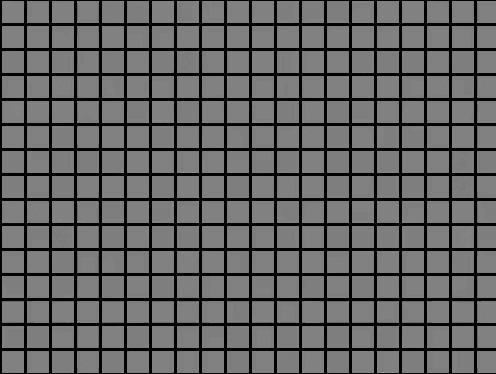

# Maze Generator and solver

First, we create a random maze. The starting point is located at the upper-left cell, while the endpoint is situated at the lower-right cell. Importantly, a connecting path exists between the two points.
Next, we employ a backtracking technique to navigate and solve the maze.

  

The firt phase in this animation shows the maze generation, and the second phase shows in green the constructed path from the entry to the exit.
